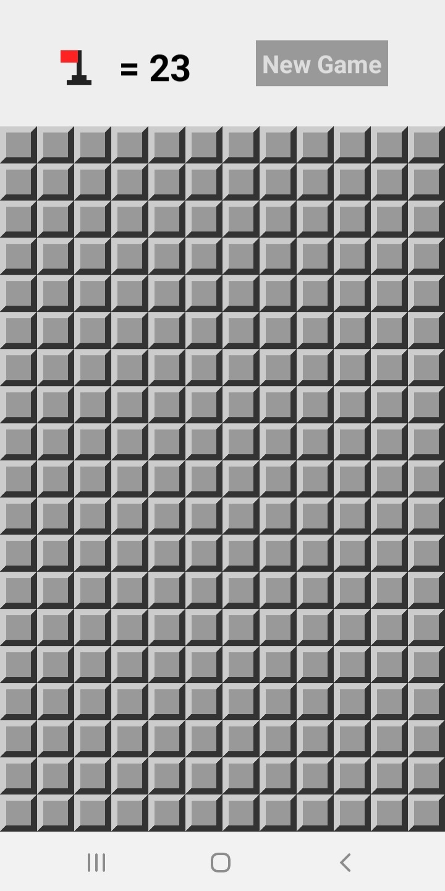
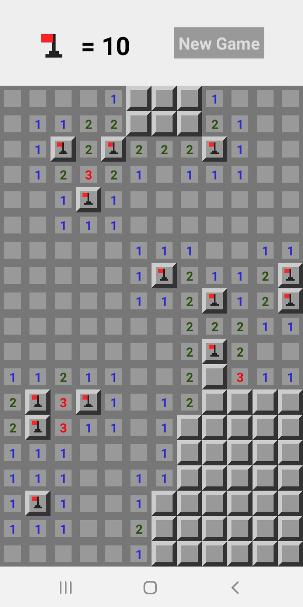
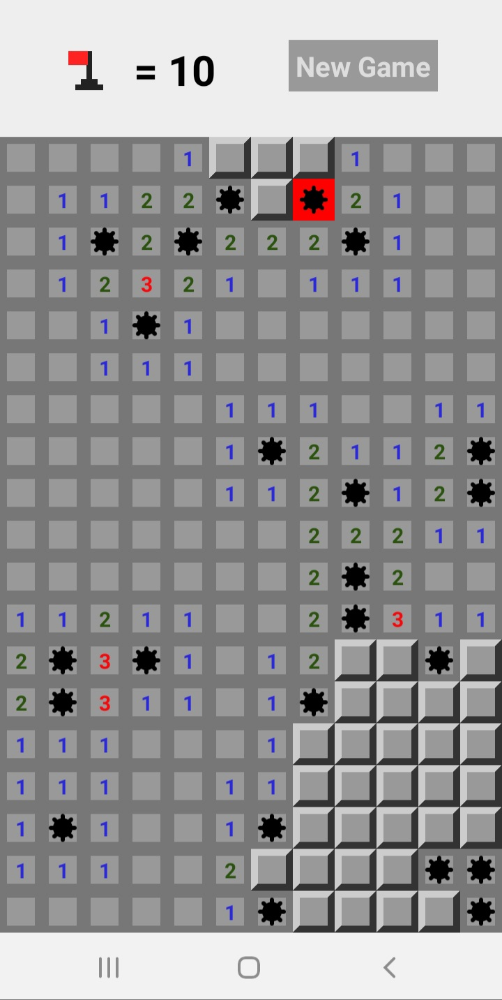
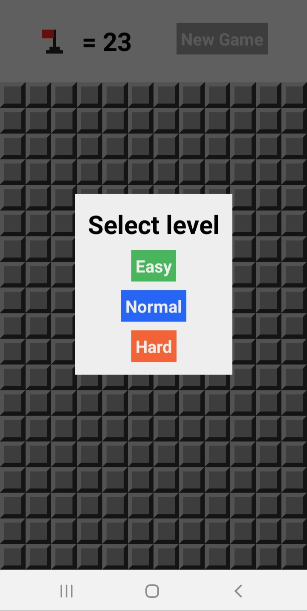

# Mine Sweeper

## Implementação em React Native do clássico Campo Minado

Aplicativo mobile para android desenvolvido em JavaScript utilizando o framework [React Native](https://reactnative.dev).

Encontre as minas espalhadas pelo campo e marque com as bandeiras para ganhar o jogo. Disponível em 3 níveis de dificuldade:

* Easy: 10% de minas;
* Normal: 20% de minas;
* Hard: 30% de minas.

### Telas

### Jogue

Você pode testar esse aplicativo em seu dispositivo Android ou iOS utilizando o aplicativo Expo Go, da plataforma Expo. Com o Expo Go instalado basta acessar este [link](exp://exp.host/@fabiotowers/mine-sweeper) no dispositivo ou scanear o QR Code que aparece.

Nos dispositivos Android também é possível fazer o download do arquivo instalação [neste link](https://github.com/fabioTowers/mine-sweeper/releases/download/v1.0/mine-sweeper.apk).